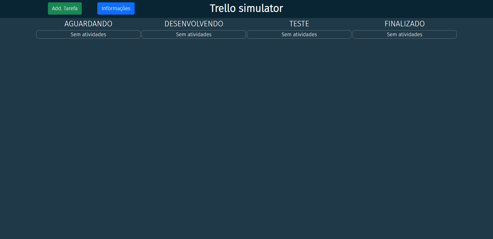
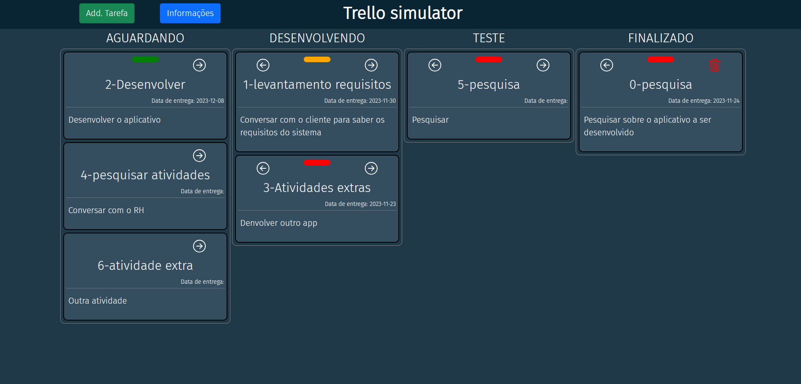
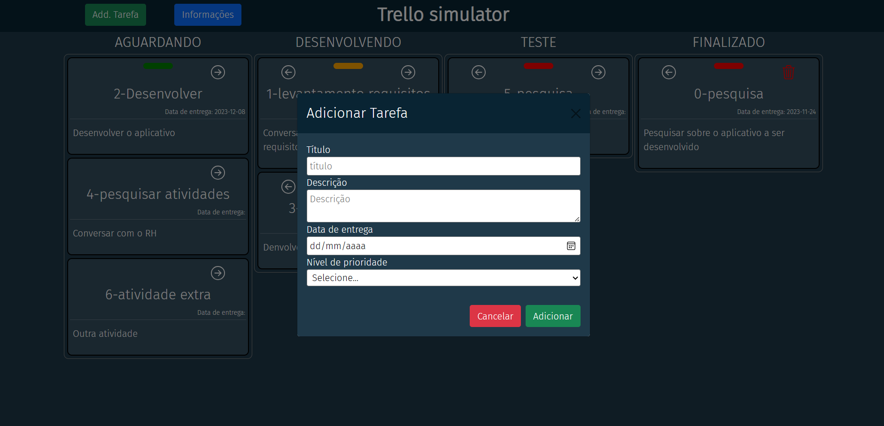
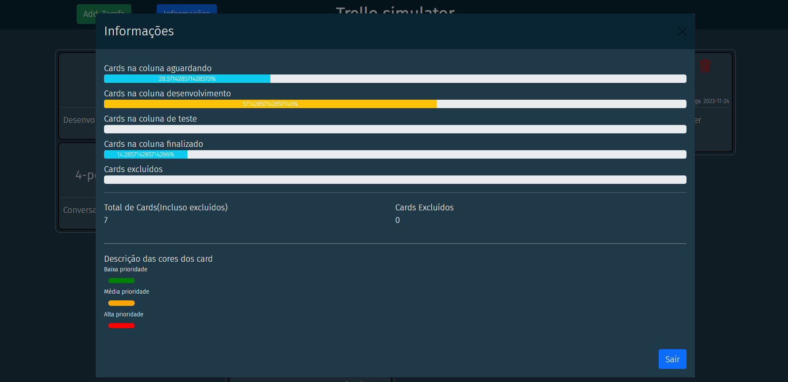

# trello-simulator
    Desenvolvimento de um app para cadastro de atividades como se fosse um trello para organizar atividades

## alunos envolvidos 
    João Vitor Girardi
    Welson Douglas Oliveira Gomes

## visão inicial do board

## visão com alguns card dispostos no board

## modal para adicionar uma nova atividade

## modal com informações do andamento do trabalho
